# ADNI Classification Based on ConvNeXt

**Author:** Xiangwen Huang  
**Student ID:** 49085949

---

## Overview

ConvNeXt is a modern convolutional neural network that incorporates design principles from Vision Transformers while maintaining the efficiency and inductive biases of traditional CNNs. With its inverted bottleneck structure, depthwise separable convolutions, and advanced normalization techniques, ConvNeXt has shown remarkable potential in medical image classification tasks.

This project applies the ConvNeXt-Small model to perform binary classification on the ADNI (Alzheimer's Disease Neuroimaging Initiative) dataset, distinguishing between Alzheimer's Disease (AD) patients and Cognitively Normal (CN) individuals. The primary objective is to achieve **test accuracy ≥ 80%** and explore ConvNeXt's classification capabilities on single-channel grayscale medical images.

---

## Model and Algorithm

### Model introduction

`ConvNeXt` is a modernized convolutional architecture that reinterprets classic CNNs with Transformer-inspired design principles. It follows the Swin Transformer’s stage ratio (3:3:9:3) and uses a patchify stem with 4×4 convolutions to efficiently extract features. By introducing depthwise convolutions and an inverted bottleneck structure, it enhances spatial representation while maintaining computational efficiency. Replacing BatchNorm with LayerNorm, ReLU with GELU, and using larger 7×7 depthwise kernels further improves training stability and performance. 

Overall, ConvNeXt preserves the inductive bias of CNNs while achieving Transformer-level accuracy and scalability—showing how thoughtful architectural refinement can bridge the two paradigms.


### Architecture Diagram
The structure of the model is as followed:
```
Input (1×224×224)
    ↓
Stem (4×4 conv, stride=4) → 96 channels
    ↓
Stage 1: 3 ConvNeXt Blocks (96 channels)
    ↓ Downsample (2×2 conv, stride=2)
Stage 2: 3 ConvNeXt Blocks (192 channels)
    ↓ Downsample
Stage 3: 9 ConvNeXt Blocks (384 channels)
    ↓ Downsample
Stage 4: 3 ConvNeXt Blocks (768 channels)
    ↓
Global Average Pooling
    ↓
LayerNorm + Linear Head → 2 classes (AD/CN)
```

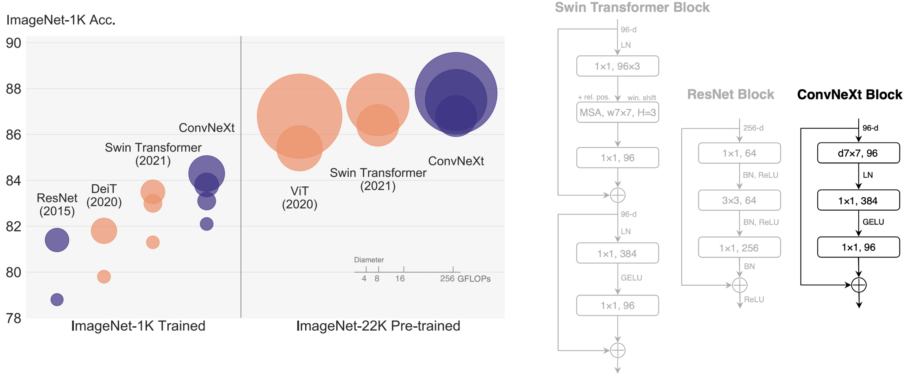

*figure1: structure of convnext compared with Resnet and swin transformer[1]


### Model Specifications

For this project, I selected **ConvNeXt-Small** considering both performance and computational efficiency:

- **Total Parameters:** 49.45M
- **Trainable Parameters:** 49.45M
- **FLOPs:** 8.72 GMac
- **Reported Top-1 Accuracy (ImageNet-22K):** 84.6% [2]

ConvNeXt-Small offers an optimal balance between accuracy and inference speed, making it suitable for deployment in resource-constrained medical imaging environments. My implementation (in `utils.py`) provides interfaces for other ConvNeXt variants (Tiny, Base, Large, XLarge) for future comparison and experimentation.

---

## Dependencies

### Python Libraries
```
torch>=2.5.1
torchvision>=0.20.1
timm>=1.0.20
scikit-learn>=1.5.2
matplotlib>=3.10.0
seaborn>=0.13.2
tqdm>=4.67.1
pandas>=2.3.2
numpy>=2.0.1
pillow>=10.0.0
ptflops>=0.7.0
```

### Hardware Configuration (Reference)

- **GPU:** NVIDIA GeForce RTX 4060
- **CUDA Version:** 12.8
- **VRAM:** 8 GB
- **Training Time:** about 3 min per epoch

---

## Dataset

### Original Dataset

The ADNI dataset consists of **30,520 grayscale brain MRI images** (256×240 pixels) with two classes:
- **AD (Alzheimer's Disease):** Patients diagnosed with Alzheimer's
- **CN/NC (Cognitively Normal):** Healthy control subjects

Initial split: Training = 21,520 images, Test = 9,000 images

### Directory Structure
```
ADNI/
├── train/
│   ├── AD/          # Alzheimer's Disease images
│   └── NC/          # Normal Cognition images
└── test/
    ├── AD/
    └── NC/
```

### Preprocessing

#### 1. Train/Validation/Test Split

To implement early stopping and prevent overfitting, I re-split the original test set into validation and test sets. Importantly, **splitting was performed by patient ID** (not random) to ensure that different slices from the same patient do not leak between datasets.

| Split      | Image Count | Percentage |
|------------|-------------|------------|
| Training   | 21,520      | 70.6%      |
| Validation | 4,500       | 14.7%      |
| Test       | 4,500       | 14.7%      |

#### 2. Image Transformations

Data augmentation on the training set can significantly improve the model’s generalization ability, especially when the dataset is relatively small. I did the following operations in the final version:

**Training Set Augmentation:**
- Resize to 224×224 (ConvNeXt input requirement)
- RandomHorizontalFlip (p=0.5)
- RandomRotation (±10°)
- RandomAffine (translate: ±5%, scale: 0.95-1.05)
- ColorJitter (brightness: ±10%, contrast: ±10%)
- ToTensor + Normalization (mean/std computed from training set)

**Validation/Test Set:**
- Resize to 224×224
- ToTensor + Normalization (same parameters)

---

## Usage

### Project Structure
```
recognition/ADNI_classification_49085949/
├── result_record/          # Historical training results
│   ├── normal/            # Normal training (no early stopping)
│   ├── earlystopping/     # Early stopping experiment
│   └── predict/           # Prediction examples
├── results/               # Current training outputs
│   ├── confusion_matrix/
│   ├── plots/
│   └── *.pth             # Model checkpoints
├── dataset.py            # Data loading and preprocessing
├── modules.py            # ConvNeXt model architecture
├── utils.py              # Model builder functions
├── train.py              # Training script
├── predict.py            # Inference script
└── README.md             # This file
```

### Training

Both `train.py` and `predict.py` support command-line arguments for flexible configuration.

Example training command:
```bash
python train.py \
    --batch_size 32 \
    --epochs 120 \
    --lr 5e-4 \
    --weight_decay 0.05 \
    --device cuda \
    --datapath "Data/AD_NC" \
    --model_name convnext_small \
    --early_stopping \
    --patience 15
```

#### Key Arguments

- `--batch_size`: Batch size for training (default: 32)
- `--epochs`: Maximum training epochs (default: 100)
- `--lr`: Initial learning rate (default: 1e-4)
- `--weight_decay`: L2 regularization coefficient (default: 0.05)
- `--early_stopping`: Enable early stopping mechanism
- `--patience`: Patience epochs for early stopping (default: 15)
- `--device`: Training device ('cuda' or 'cpu')

#### Training Outputs

The training script generates the following results in `results/`:

1. **Model Checkpoint:** `{model_name}_best.pth` (best validation accuracy)
2. **Confusion Matrix:** Validation and test set confusion matrices
3. **Training Curves:**
   - Accuracy curve (train & validation)
   - Loss curve (train & validation)
   - Learning rate schedule
4. **Classification Reports:** Detailed metrics (precision, recall, F1-score)

### Prediction

Example prediction command:
```bash
python predict.py \
    --mode auto \
    --num_images 10 \
    --device cuda \
    --model_path "results/convnext_small_best.pth" \
    --datapath "Data/AD_NC"
```

#### Prediction Modes

- `auto`: Randomly select `num_images` from test set
- `custom`: Predict on user-specified image paths

---

## Results and Analysis

### Training Optimizations

To enhance training performance and mitigate overfitting, I implemented the following techniques:

- **Automatic Mixed Precision (AMP):** Reduces memory usage and accelerates training
- **Gradient Clipping:** Prevents gradient explosion (max_norm=1.0)
- **Label Smoothing (0.1):** Improves generalization by softening hard labels
- **Cosine Annealing LR Scheduler:** Smoothly decays learning rate from base_lr to 0.01×base_lr
- **Early Stopping:** Halts training when validation accuracy plateaus

I conducted two experimental scenarios to evaluate the impact of early stopping and assess overfitting:

1. **Normal Training:** 100 epochs without early stopping
2. **Early Stopping:** Maximum 100 epochs with patience=15

---

### Experiment 1: Normal Training (100 Epochs)

#### Training Progress

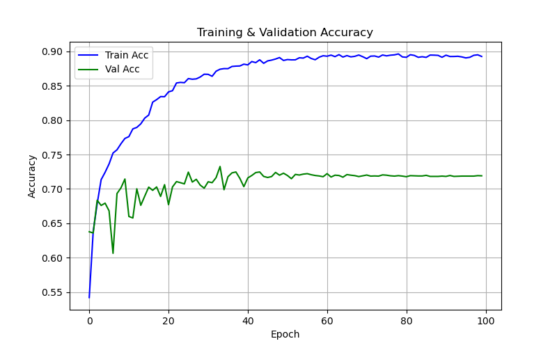

*Figure 2: Training and validation accuracy over 100 epochs*

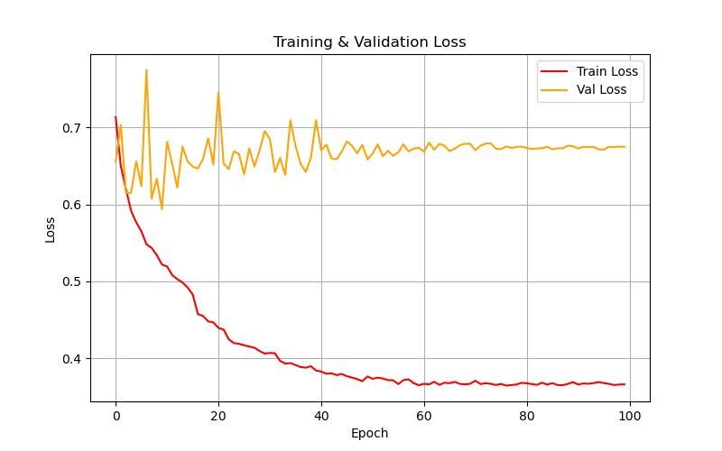

*Figure 3: Training and validation loss over 100 epochs*

#### Test Results

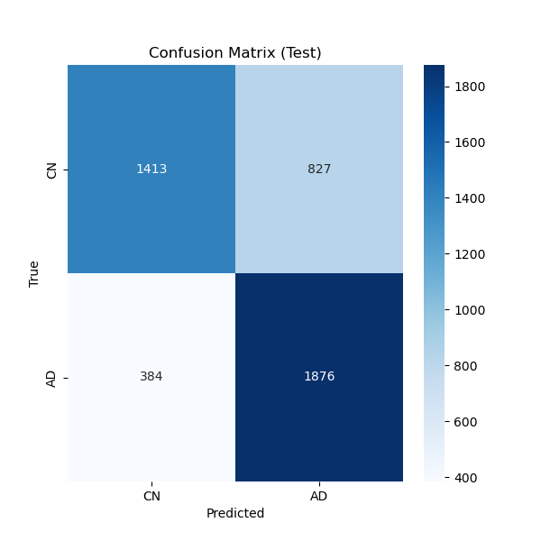

*Figure 4: Confusion matrix on test set*

#### Classification Report
```
              precision    recall  f1-score   support
          CN     0.7863    0.6308    0.7000      2240
          AD     0.6940    0.8301    0.7560      2260

    accuracy                         0.7309      4500
   macro avg     0.7402    0.7304    0.7280      4500
weighted avg     0.7400    0.7309    0.7281      4500
```

#### Analysis

- **Training Accuracy:** Steadily increased to about 90%, demonstrating model's learning capacity
- **Validation Accuracy:** Fluctuated initially, then stabilized around 73% after epoch 40
- **Training Loss:** Consistently decreased throughout training
- **Validation Loss:** High volatility in early epochs, then plateaued around 0.68

**Observations:**
1. No significant validation loss increase in later epochs indicates that regularization techniques (weight decay, label smoothing, data augmentation) effectively prevented severe overfitting
2. The ~22% gap between training and validation accuracy suggests moderate overfitting, which is typical for medical imaging tasks with limited data
3. **Test Accuracy: 73.09%** with balanced performance across both classes
4. Higher recall for AD class (83.01%) vs CN class (63.08%) - model is more sensitive to detecting Alzheimer's cases, which is clinically desirable

---

### Experiment 2: Early Stopping (Patience=15)

Training terminated at **Epoch 24** due to no improvement in validation accuracy.

#### Training Progress

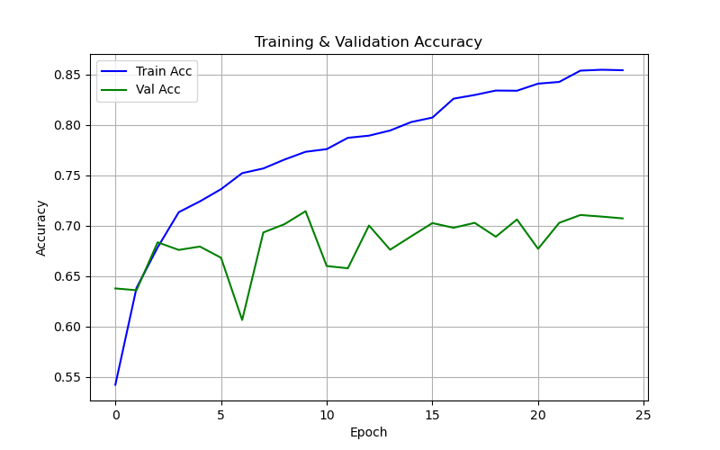

*Figure 5: Training halted early at epoch 24*

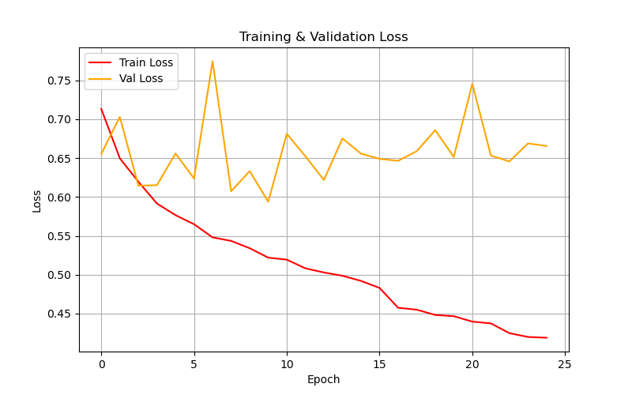

*Figure 6: Loss curves showing early convergence*

#### Test Results


*Figure 7: Test confusion matrix (early stopped model)*

#### Classification Report
```
              precision    recall  f1-score   support
          CN     0.7832    0.6031    0.6815      2240
          AD     0.6796    0.8345    0.7492      2260

    accuracy                         0.7193      4500
   macro avg     0.7314    0.7188    0.7153      4500
weighted avg     0.7312    0.7193    0.7155      4500
```

#### Analysis

The model achieved 71.93% test accuracy in just 24 epochs, training about four times faster than the 100-epoch setup, with only a 1.16% accuracy drop, demonstrating strong training efficiency. However, the consistent train-validation gap (around 80% vs 73%) suggests that the model had already reached its generalization limit early, and further training brought limited improvement.

**Key Insights:**
Extended training beyond 30 epochs yields only minimal accuracy improvements, indicating that the model has likely reached a performance plateau on this dataset. Early stopping proves effective in reducing computational costs while still maintaining competitive performance. The consistent gap between training and validation results across experiments suggests that further improvements may require larger and more diverse datasets, more sophisticated domain-specific augmentations, or potentially ensemble methods and architectural modifications.

---

### Prediction Examples

Using the trained model in `auto` mode, I randomly selected 6 test images for inference:

<table>
  <tr>
    <td>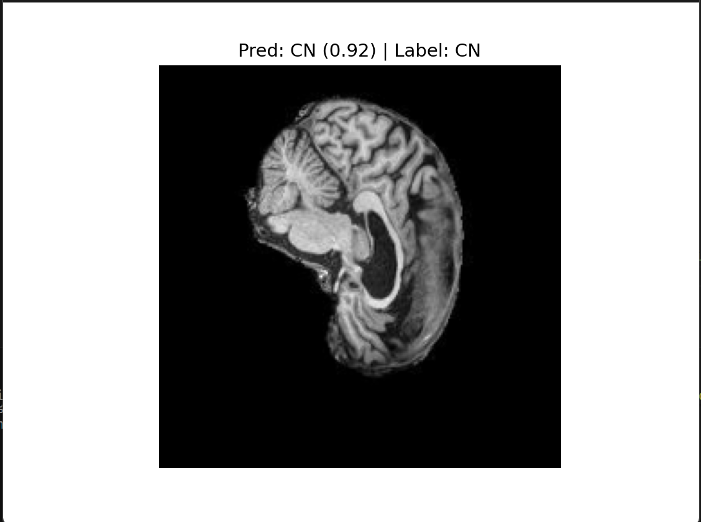</td>
    <td>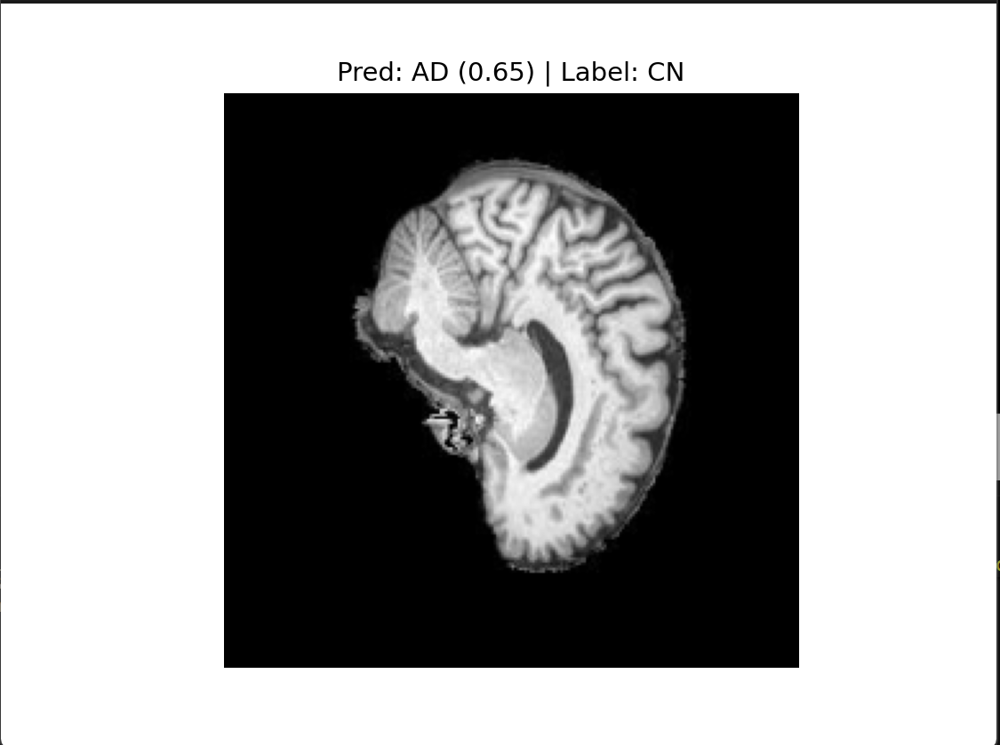</td>
    <td>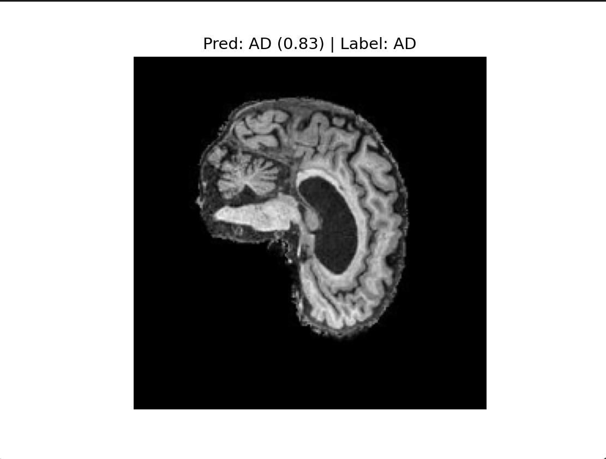</td>
  </tr>
  <tr>
    <td>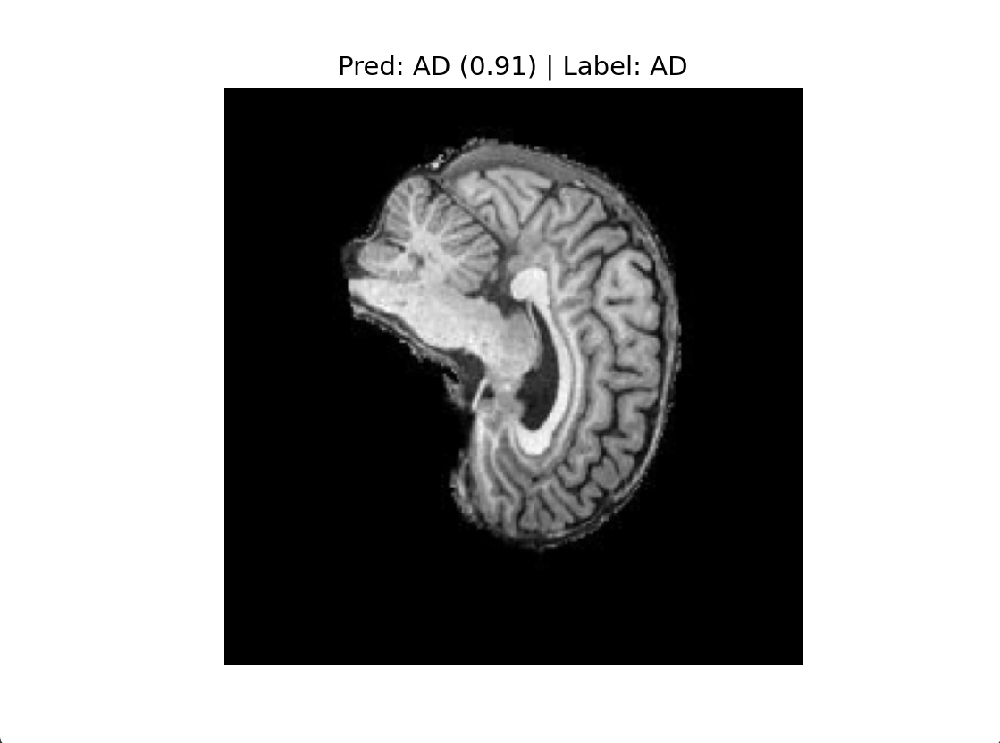</td>
    <td>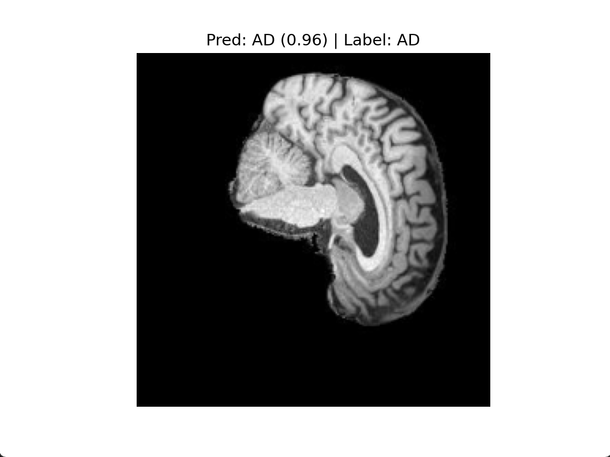</td>
    <td>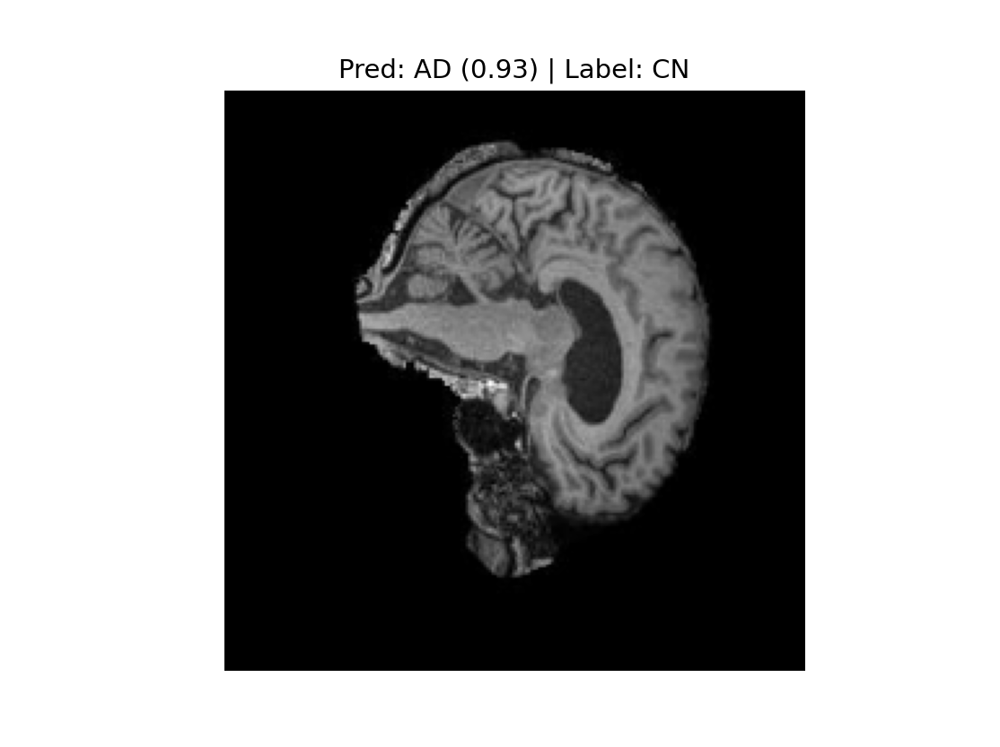</td>
  </tr>
</table>


#### Prediction Summary

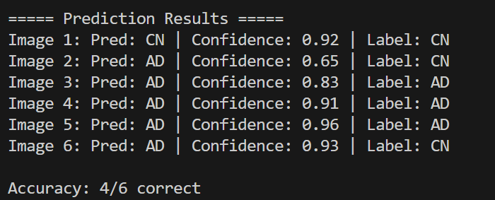

*Figure 8: Summary table comparing predictions vs ground truth with confidence scores*

The confidence scores (softmax probabilities) provide interpretable decision-making insights, which is crucial for clinical deployment. From the results above, 4 out of the 6 images were correctly classified. The two misclassified images were normal brains incorrectly diagnosed as AD. This type of error is somewhat less severe compared to misclassifying AD cases as normal.

---

## Future Improvements

Future improvements could explore larger ConvNeXt models or ensemble approaches, incorporating attention mechanisms to focus on key brain regions, and even try 3D ConvNeXt for volumetric MRI analysis. More advanced models, such as Med Mamba from the recent Vision Mamba framework, can also be considered. For data and training, increasing the dataset size and applying domain-specific augmentations (e.g., elastic deformation, intensity adjustment), regularization, or transfer learning can further improve performance. Evaluation strategies like cross-validation can be used to enhance the model’s generalization ability.

---

## References

[1] Liu, Z., Mao, H., Wu, C.-Y., Feichtenhofer, C., Darrell, T., & Xie, S. (2022). *A ConvNet for the 2020s.* arXiv preprint arXiv:2201.03545.Accessed: Oct.18, 2025. [online] Available:https://arxiv.org/abs/2201.03545
[2] Liu, Z., Mao, H., Wu, C.-Y., Feichtenhofer, C., Darrell, T., & Xie, S. (2022). A ConvNet for the 2020s (Code release: Facebook Research ConvNeXt) [GitHub repository]. GitHub. https://github.com/facebookresearch/ConvNeXt

---
**AI Usage Statement**:
In this project, AI(ChatGPT 5.0, oct. 2025 and claude sonnet 4.5, oct. 2025) was used to assist in code optimization, structural refinement, and comment organization. It also helped improve the fluency of certain descriptions in the README. However, the core implementation of the code and the content of the README were entirely completed by me.